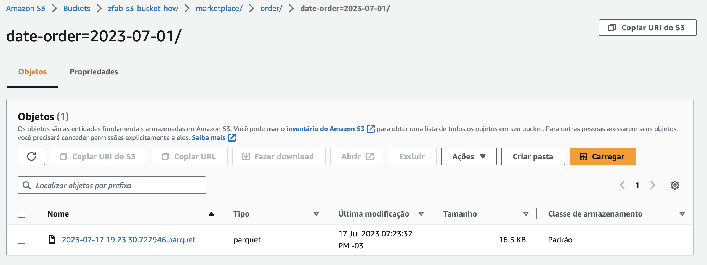

# Howbootcamp - Fake Generator

Esse repositório contém a resolução do primeiro desafio do bootcamp de Engenharia de Dados da Howbootcamp.

O objetivo desse desafio consistia na geração de dados falsos e ingestão deles em um bucket S3 da AWS. Após a ingestão era preciso gerar através de um Crawler (AWS Glue) a tabela com os dados para consulta na AWS Athena.

Etapas:

1. Criar uma conta AWS
2. Gerar dados necessários utilizando a biblioteca Faker do Python
3. Armazenar os dados em um Bucket do AWS S3
4. Criar um Crawler dos dados com o AWS Glue
5. Escrever 3 consultas nos dados utilizando o AWS Athena

## Contexto

Para o desafio foi proposto o cenário de um Marketplace web onde empresas vendem seus produtos. Os dados gerados são os pedidos realizados em uma determinada data.

|Campo|Descrição|
|--|--|
|date_order|Data do pedido|
|seller|Nome da empresa vendedora|
|customer|Nome do comprador|
|qtd_itens|Quantidade de itens comprados|
|order_value|Valor da compra|
|freight_value|Valor do frete|
|delivery_address|Endereço de entrega|
|delivery_type|Tipo de entrega|
|delivery_date|Previsão de entrega|
|payment_type|Tipo de pagamento|
|order_status|Situação do pedido|


## Arquitetura da Solução


- O arquivo [main.py](main.py) é responsável executar a ingestão ao ser executada por linha de comando
- O arquivo [ingestor.py](libs/ingestor.py) contem as classes responsáveis pelo processo de ingestão dos dados
- O arquivo [generator.py](libs/generator.py) contem a classe responsável por gerar as informações fakes utilizando a biblioteca [Faker](https://faker.readthedocs.io/en/master/#how-to-create-a-provider)
- O arquivo [writer.py](libs/writer.py) contem as classes responsáveis por salvar os dados, seja localmente em formato JSON ou na AWS S3 através da biblioteca Boto3
- Um Crawler do AWS Glue é criado para criar (ou atualizar) tabelas com base nos arquivos adicionados no bucket S3
- O AWS Athena utiliza o catálogo (metadados) criado para realizar as consultas nos dados salvo no S3


## Scripts

Para gerar e fazer a ingestão dos dados basta rodar o script `main.py` passando alguns parametros:

|Parâmetro|Descrição|Formato / Opções|
|--|--|--|
|**`-start` ou `-s`**|Data de Início|`%Y-%m-%d`
|**`-end` ou `-e`**|Data de Fim|`%Y-%m-%d`
|**`-type` ou `-t`**|Local de ingestão|`local` ou `S3`|

Exemplo de execução

```bash
python3 main.py -s '01-07-2023' -e '31-07-2023' -t 'S3'
```

## AWS S3



Os dados gerados são salvos em um bucket chamado `zfab-s3-bucket-how` e na pasta `marketplace`. Dentro é separado por `<schema name>` e particionado por `data de pedido` (no caso dos dados de exemplo do script).

A ingestão no bucket é feito através da biblioteca Boto3. Caso o bucket não exista ele é criado automaticamente

## AWS Glue


Um Crawler foi criado no AWS Glue para geração automática dos schemas e partições com base nos dados salvos no bucket S3.

No exemplo criado o crawler roda manualmente porém é possível configura-lo para executar sempre que novos arquivos são adicionados ou em uma cadência pré-definida.

## AWS Athena

Com o schema criado pelo Crawler do AWS Glue é possível realizar consultas nos dados salvos no bucket S3 utilizando o AWS Athena.

Foram feitas três consultas de exemplo:

1. Quantidade de Pedidos por dia agrupados por Situação:


2. Quantidade de Pedidos e Total de vendas realizado por cada vendedor:


3. Média de valor de pedidos por tipo de pagamento:


